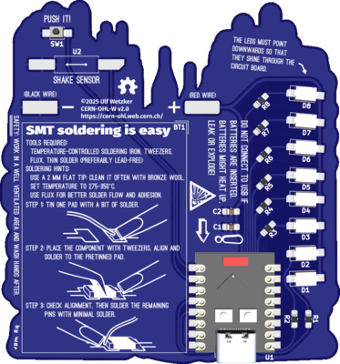

[](README.md)

# ハッカー (Hakkā) - Eine Einführung in SMD-Löten und Mikrokontroller-Programmierung




# Setup

## Toolchain
1. [Rustup.rs](https://rustup.rs/)
2. [The Rust on ESP Book
](https://docs.espressif.com/projects/rust/book/installation/riscv.html)
3. [hakkaa-firmware](https://github.com/sirhcel/hakkaa-firmware)
4. Espflash
    ```
    $ cargo install --locked espflash
    ```
    `--locked` installiert genau die im Projekt hinterlegten Versionen der Abhängigkeiten

# Test von Setup und Hardware

* Hardware-Test ausführen, Informationen und Anweisungen gibt es über die Log-Ausgaben
    ```
    $ cargo run --bin eol-test
    ```

# Eigene Firmware fürs Target

* Dokumentation für Hakkaa-Board-Support und benutzte Module erstellen und im Browser anzeigen lassen
    ```
    $ cargo doc --open
    ```

* Auf Basis einer Kopie des Blinky-Beispiels `examples/blinky.rs`
* Kopie in `src/bin` erstellen, zum Beispiel `src/bin/pov.rs`
* Anschließend analog zum Hardware-Test ausführen
   ```
   $ cargo run --bin pov
   ```

# Lizenz

Dieses Werk ist unter einer der folgenden Lizenzen nutzbar:

* Apache-Lizenz, Version 2.0 (LICENSE-APACHE or
  http://www.apache.org/licenses/LICENSE-2.0)
* MIT-Lizenz (LICENSE-MIT or http://opensource.org/licenses/MIT)

# Beiträge

Wenn nicht explizit anderweitig andgegeben, werden alle Beiträge zu diesem Werk
im Sinne der Apache-Lizenz als wie oben dual lizenziert und ohne zusätzliche
Bedingugngen entgegengenommen.
